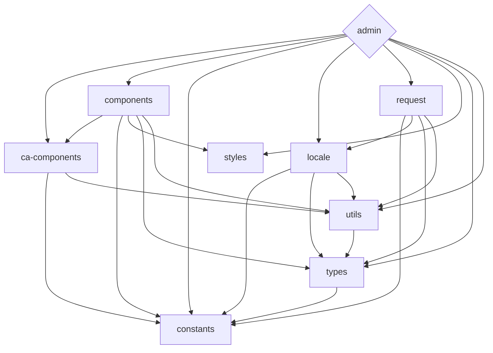

<div align='center'>
<h1>Celeris Admin</h1>

</div>

<div align='center'>
<b>English</b> | <a href="README.zh-CN.md">简体中文</a>
</div>

## Introduction
Celeris Admin is a free and open-source middle and back-end template built with the latest technologies. Using Vue3, Vite, TypeScript, and other cutting-edge tools, it provides a comprehensive solution for front-end development. Additionally, its monorepo approach makes it easy to manage dependencies and collaborate on multiple projects.

This template is not only suitable for production use, but it can also serve as a valuable learning resource for developers who want to familiarize themselves with the latest technology stack.

Get started with Celeris-admin today and streamline your front-end development process.


## Features

- ⚡  [Vue 3](https://github.com/vuejs/vue-next), [Vite](https://github.com/vitejs/vite), [pnpm](https://pnpm.js.org/) - born with fastness
- 💪 [Typescript](https://www.typescriptlang.org/) - of course! necessary
- 📂 Use the [monorepo](https://en.wikipedia.org/wiki/Monorepo) 
- 🔥 Use the [new `<script setup>` syntax](https://github.com/vuejs/rfcs/pull/227)
- 🤙🏻 [Reactivity Transform](https://vuejs.org/guide/extras/reactivity-transform.html) enabled
- 📦 [Components auto importing](./src/components)
- 📥 [APIs auto importing](https://github.com/antfu/unplugin-auto-import) - use Composition API and others directly
- 💡 [Vue Router v4](https://router.vuejs.org/zh/) - The official router for Vue.js
- 🎉 [NProgress](https://github.com/rstacruz/nprogress) - Page loading progress feedback
- 🍍 [State Management via Pinia](https://pinia.esm.dev/) - The Vue Store that you will enjoy using
- 📜 [Chinese font preset]()
- 🌍 [I18n ready](./src/locales)
- ☁️ Deploy on Netlify, zero-config


### Coding Style

- [@kirklin/eslint-config](https://github.com/kirklin/eslint-config)

### Recommended IDE Setup

- [VSCode](https://code.visualstudio.com/)
- [Volar](https://marketplace.visualstudio.com/items?itemName=johnsoncodehk.volar)


### [packages](packages) dependency relationship



To update the diagram above edit the README file and open a new PR with the changes.

## Try it now!

### GitHub Template

[Create a repo from this template on GitHub](https://github.com/kirklin/celeris-admin/generate).

### Clone to local

```bash
npx degit kirklin/celeris-admin my-vite-app
cd my-vite-app
pnpm i
```

## Usage

### Development

Just run and visit http://localhost:8888

```bash
pnpm run dev
```

### Build

To build the App, run

```bash
pnpm run build
```

And you will see the generated file in `dist` that ready to be served.


### Deploy on Netlify

Go to [Netlify](https://app.netlify.com/start) and select your clone, `OK` along the way, and your App will be live in a minute.

### Docker Production Build

First, build the celeris-admin image by opening the terminal in the project's root directory.

```bash
docker buildx build . -t CelerisAdmin:latest
```

Run the image and specify port mapping with the `-p` flag.

```bash
docker run --rm -it -p 8080:80 CelerisAdmin:latest
```

