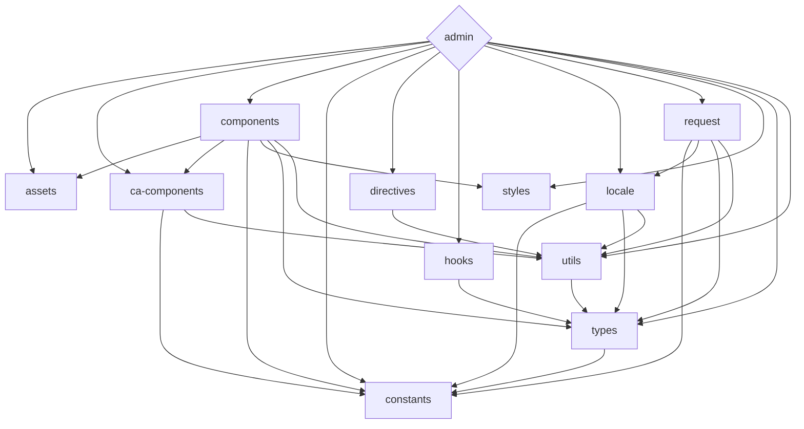

<div align='center'>
<h1>Celeris Web</h1>

</div>

<div align='center'>
<b>English</b> | <a href="README.zh-CN.md">简体中文</a>
</div>

## Introduction

Celeris Web is a free and open-source front-end development framework that utilizes the latest technologies, including Vue 3, Vite, and TypeScript. Its monorepo approach makes it easy to manage dependencies and collaborate on multiple projects, providing developers with a comprehensive solution for building modern web applications.

One of the standout features of Celeris Web is its integration with OpenAI's ChatGPT API, which provides access to powerful natural language processing capabilities. This integration allows developers to easily incorporate natural language processing into their applications, making it an ideal choice for projects that require this functionality.

Whether you're a seasoned developer or just starting out, Celeris Web offers a streamlined front-end development process that leverages the latest tools and techniques.

Get started with celeris-web today and experience a highly streamlined front-end development process that harnesses the power of the latest technologies, including cutting-edge natural language processing capabilities.

## Features

- ⚡ [Lightning fast](https://github.com/kirklin/celeris-web#readme): Built with Vue 3, Vite, and pnpm 🔥
- 💪 [Strongly typed](https://www.typescriptlang.org/): Uses TypeScript 💻
- 📂 [Monorepo approach](https://en.wikipedia.org/wiki/Monorepo): Makes it easy to manage dependencies and collaborate on multiple projects 🤝
- 🔥 [Latest syntax](https://github.com/vuejs/rfcs/pull/227): Uses the new <script setup> syntax 🆕
- 📦 [Components auto importing](https://github.com/kirklin/celeris-web/blob/master/packages/node/vite/src/plugins/unpluginVueComponets.ts): Automatically imports components 🚚
- 📥 [APIs auto importing](https://github.com/kirklin/celeris-web/blob/master/packages/node/vite/src/plugins/unpluginAutoImport.ts): Uses unplugin-auto-import to directly import Composition API and others 📨
- 💡 [Official router](https://router.vuejs.org/): Uses Vue Router v4 🛣️
- 🎉 [Loading feedback](https://github.com/rstacruz/nprogress): Uses NProgress to provide page loading progress feedback 🔄
- 🍍 [State management](https://pinia.esm.dev/): Uses Pinia for state management 🗃️
- 📜 [Chinese font preset](https://github.com/kirklin/unocss-preset-chinese): Includes a preset for Chinese fonts 🇨🇳
- 🌍 [I18n ready](https://github.com/kirklin/celeris-web/tree/master/packages/web/locale): Ready for internationalization with locales 🌎
- ☁️ [Netlify ready](https://www.netlify.com/): Zero-config deployment on Netlify ☁️
- 🤖 Integration with [OpenAI's ChatGPT API](https://openai.com/https://openai.com/): for natural language processing 🤖

### Coding Style

- [@kirklin/eslint-config](https://github.com/kirklin/eslint-config)

### Recommended IDE Setup

- 🌪️ [WebStorm](https://www.jetbrains.com/webstorm/)
- 💻 [VSCode](https://code.visualstudio.com/)
- 💡 [Volar](https://marketplace.visualstudio.com/items?itemName=johnsoncodehk.volar)

### [packages](packages) dependency relationship



To update the diagram above edit the README file and open a new PR with the changes.

## Bilingual Comments in Code

In the design of Celeris Web, we emphasize the readability and learnability of the code. To achieve this, each function is equipped with bilingual comments in both Chinese and English, ensuring that developers, regardless of their native language, can easily understand and learn from the code.

**Why Choose Bilingual Comments?**

1. **Global Collaboration:** In multicultural teams, bilingual comments foster better communication and collaboration, ensuring that team members can accurately comprehend the functionality and implementation of the code.

2. **Convenient Learning:** For beginners, bilingual comments provide a more user-friendly learning environment, aiding them in quickly grasping the logic and structure of the code.

3. **Developer-Friendly:** We are committed to creating a developer-friendly environment, and bilingual comments are a crucial measure we've taken to achieve this goal.

**Example:**

```typescript
   /**
    * 打开一个新的浏览器窗口
    * Open a new browser window
    *
    * @param {string} url - 要在新窗口中打开的 URL
    * The URL to open in the new window
    *
    * @param {object} options - 打开窗口的选项
    * Options for opening the window
    * @param {string} options.target - 新窗口的名称或特殊选项，默认为 "_blank"
    * @param {string} options.features - 新窗口的特性（大小，位置等），默认为 "noopener=yes,noreferrer=yes"
    */
   export function openWindow(url: string, { target = "_blank", features = "noopener=yes,noreferrer=yes" }: {
     target?: "_blank" | "_self" | "_parent" | "_top"; // 新窗口的名称或特殊选项，默认为 "_blank"
     features?: string; // 新窗口的特性（大小，位置等），默认为 "noopener=yes,noreferrer=yes"
   } = {}) {
     window.open(url, target, features);
   }
```

Through these bilingual comments, we aim to provide developers with a more enjoyable and efficient coding experience, making Celeris Web a frontend template that is truly easy to pick up and dive into.

## Benefits of Monorepo Design

**1. Easier Dependency Management:** Monorepo centralizes the management of dependencies for all projects, avoiding version conflicts between different projects and making overall dependency management clearer and simpler.

**2. Code Sharing and Reusability:** Different projects can easily share and reuse code, reducing the workload of redundant development. This is highly beneficial for maintaining code consistency and improving development efficiency.

**3. Unified Build and Deployment:** Monorepo simplifies the entire development process through a unified build and deployment workflow, reducing the complexity of configuration and management and enhancing collaboration efficiency within the development team.

**4. Unified Version Control:** With all projects in the same version control repository, version management becomes more consistent and controllable. This helps the team better track and handle version-related issues. The Monorepo design positions Celeris Web not only as an admin system template but also as a frontend web template for rapidly developing C-end products. With Celeris Web, the journey of frontend development becomes even more relaxed and enjoyable! 🚀

## Design Philosophy: Breaking the Limits of Admin Management, Focusing on C-End User Experience

In the market, most frontend templates primarily cater to the needs of B-end users, providing powerful features and flexible interfaces for enterprise management systems (Admin). However, few templates consider the characteristics of C-end products in their design, and this is where Celeris Web innovates.

**Breaking the Limits of Admin Management:**

Traditional Admin management systems prioritize data display and business management, while C-end products emphasize user experience and visual appeal. Recognizing C-end users' demands for aesthetically pleasing interfaces and smooth interactions, Celeris Web not only offers robust backend management features but also focuses on elevating the frontend interface to a higher level of user satisfaction.

**Focusing on C-End User Experience:**

Celeris Web is not just a template for admin systems; it's a frontend web template that prioritizes the user experience for C-end products. We aim to break free from the constraints of traditional Admin systems by introducing innovative design principles, ensuring that C-end products presented on the frontend deliver an outstanding user experience.

**Highlighted Features:**

- **Stylish and Aesthetic UI Design:** We prioritize visual aesthetics, utilizing modern design languages to make Celeris Web's UI not just a compilation of features but a visual feast that captivates C-end users.
- **User-Friendly Interaction Experience:** Considering the habits and needs of C-end users, Celeris Web emphasizes interactive design. Through smooth animation effects and intuitive operations, users can experience unprecedented pleasure and convenience.
- **Customizable Themes for Personalization:** Recognizing the diversity of C-end products, we provide a rich set of theme customization options, allowing each C-end project to have a unique appearance that perfectly aligns with personalized requirements.

With this unique design philosophy, Celeris Web strives to explore new possibilities in frontend development, injecting more vitality and creativity into C-end products. We believe that such innovation will garner widespread user recognition and contribute to higher product value. In the world of Celeris Web, frontend development transcends the confines of Admin systems, incorporating more exciting elements related to user experience.

## Future Development Roadmap: Targeting AIGC, Leading the Transformation of Internet Products

With the rise of Artificial Intelligence and Graph Computing (AIGC) technologies, we have decided to shift the focus of Celeris Web's development towards driving the research and implementation of AIGC-related products. This strategic decision aims to align with the wave of transformation in internet products, paving the way for new possibilities in future technological innovation.

**AIGC Technology Leading the Transformation:**

The emergence of AIGC signifies a technological revolution in the internet industry, bringing about more intelligent and interactive experiences for products. Celeris Web will actively respond to this transformation, committed to providing developers with superior tools to facilitate the creation of forward-looking AIGC applications.

**Development Focus on Templates:**

In the later stages of development, Celeris Web will pay increased attention to the research and development needs of AIGC-related products. We will introduce more functional modules tailored for artificial intelligence, enabling developers to build exceptional AIGC applications more conveniently and efficiently.

**Emphasis on Product Implementation:**

In addition to technical research and development, we will strengthen support for the implementation of AIGC products. By providing comprehensive documentation, examples, and customized services, Celeris Web aims to assist developers in seamlessly integrating AIGC technology into their actual projects, achieving an organic fusion of technological innovation and business application.

**Open Collaborative Ecosystem:**

To promote the wider application of AIGC technology, Celeris Web will actively build an open collaborative ecosystem. Collaborating closely with outstanding AIGC technology providers and developer communities, we aim to collectively drive the development of AIGC technology, contributing to the flourishing ecosystem of internet products.

The future development of Celeris Web will revolve around AIGC, and we look forward to exploring, innovating, and leading the future of internet products together with developers. Through continuous efforts and innovation, Celeris Web will become a leader in the AIGC field, empowering developers to create more intelligent and engaging internet products.

## Try it now!

### GitHub Template

[Create a repo from this template on GitHub](https://github.com/kirklin/celeris-web/generate).

### Clone to local

```bash
npx degit kirklin/celeris-web my-vite-app
cd my-vite-app
pnpm i
```

## Usage

### Development

Just run and visit http://localhost:8888

```bash
pnpm run dev
```

### Build

To build the App, run

```bash
pnpm run build
```

And you will see the generated file in `dist` that ready to be served.

### Deploy on Netlify

Go to [Netlify](https://app.netlify.com/start) and select your clone, `OK` along the way, and your App will be live in a minute.

### Docker Production Build

First, build the celeris-web image by opening the terminal in the project's root directory.

```bash
docker buildx build . -t celeris-web:latest
```

Run the image and specify port mapping with the `-p` flag.

```bash
docker run --rm -it -p 8080:80 celeris-web:latest
```
