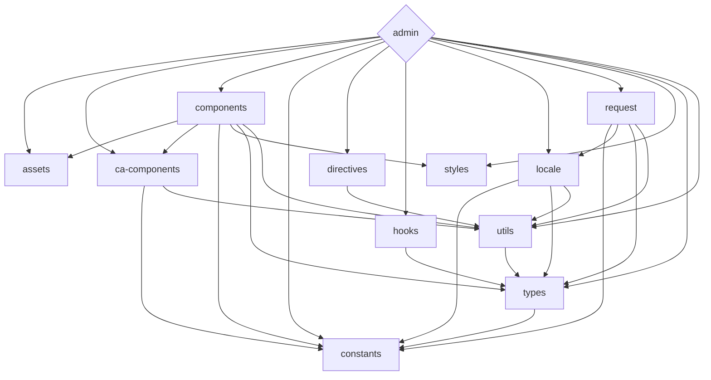

<div align='center'>
<h1>Celeris Web</h1>

</div>

<div align='center'>
<b>English</b> | <a href="README.zh-CN.md">简体中文</a>
</div>

## Introduction
Celeris Web is a free and open-source front-end development framework that utilizes the latest technologies, including Vue 3, Vite, and TypeScript. Its monorepo approach makes it easy to manage dependencies and collaborate on multiple projects, providing developers with a comprehensive solution for building modern web applications.

One of the standout features of Celeris Web is its integration with OpenAI's ChatGPT API, which provides access to powerful natural language processing capabilities. This integration allows developers to easily incorporate natural language processing into their applications, making it an ideal choice for projects that require this functionality.

Whether you're a seasoned developer or just starting out, Celeris Web offers a streamlined front-end development process that leverages the latest tools and techniques.

Get started with celeris-web today and experience a highly streamlined front-end development process that harnesses the power of the latest technologies, including cutting-edge natural language processing capabilities.


## Features

- ⚡  [Lightning fast](https://github.com/kirklin/celeris-web#readme): Built with Vue 3, Vite, and pnpm 🔥
- 💪 [Strongly typed](https://www.typescriptlang.org/): Uses TypeScript 💻
- 📂 [Monorepo approach](https://en.wikipedia.org/wiki/Monorepo): Makes it easy to manage dependencies and collaborate on multiple projects 🤝
- 🔥 [Latest syntax](https://github.com/vuejs/rfcs/pull/227): Uses the new <script setup> syntax 🆕
- 📦 [Components auto importing](https://github.com/kirklin/celeris-web/blob/master/packages/node/vite/src/plugins/unpluginVueComponets.ts): Automatically imports components 🚚
- 📥 [APIs auto importing](https://github.com/kirklin/celeris-web/blob/master/packages/node/vite/src/plugins/unpluginAutoImport.ts): Uses unplugin-auto-import to directly import Composition API and others 📨
- 💡 [Official router](https://router.vuejs.org/): Uses Vue Router v4 🛣️
- 🎉 [Loading feedback](https://github.com/rstacruz/nprogress): Uses NProgress to provide page loading progress feedback 🔄
- 🍍 [State management](https://pinia.esm.dev/): Uses Pinia for state management 🗃️
- 📜 [Chinese font preset](https://github.com/kirklin/unocss-preset-chinese): Includes a preset for Chinese fonts 🇨🇳
- 🌍 [I18n ready](https://github.com/kirklin/celeris-web/tree/master/packages/web/locale): Ready for internationalization with locales 🌎
- ☁️ [Netlify ready](https://www.netlify.com/): Zero-config deployment on Netlify ☁️
- 🤖 Integration with [OpenAI's ChatGPT API](https://openai.com/https://openai.com/): for natural language processing 🤖


### Coding Style

- [@kirklin/eslint-config](https://github.com/kirklin/eslint-config)

### Recommended IDE Setup

- 🌪️ [WebStorm](https://www.jetbrains.com/webstorm/)
- 💻 [VSCode](https://code.visualstudio.com/)
- 💡 [Volar](https://marketplace.visualstudio.com/items?itemName=johnsoncodehk.volar)


### [packages](packages) dependency relationship



To update the diagram above edit the README file and open a new PR with the changes.

## Try it now!

### GitHub Template

[Create a repo from this template on GitHub](https://github.com/kirklin/celeris-web/generate).

### Clone to local

```bash
npx degit kirklin/celeris-web my-vite-app
cd my-vite-app
pnpm i
```

## Usage

### Development

Just run and visit http://localhost:8888

```bash
pnpm run dev
```

### Build

To build the App, run

```bash
pnpm run build
```

And you will see the generated file in `dist` that ready to be served.


### Deploy on Netlify

Go to [Netlify](https://app.netlify.com/start) and select your clone, `OK` along the way, and your App will be live in a minute.

### Docker Production Build

First, build the celeris-web image by opening the terminal in the project's root directory.

```bash
docker buildx build . -t celeris-web:latest
```

Run the image and specify port mapping with the `-p` flag.

```bash
docker run --rm -it -p 8080:80 celeris-web:latest
```

