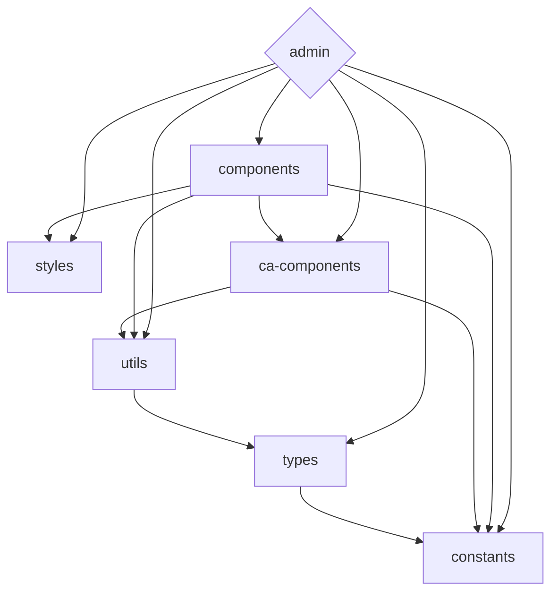

<div align='center'>
<h1>celeris-admin </h1>

</div>

<p align='center'>
Mocking up web app with <b>celeris-admin </b><sup><em>(speed)</em></sup><br>
</p>

<div align='center'>
<b>English</b> | <a href="README.zh-CN.md">简体中文</a>
</div>

## Features

- ⚡  [Vue 3](https://github.com/vuejs/vue-next), [Vite 2](https://github.com/vitejs/vite), [pnpm](https://pnpm.js.org/) - born with fastness
- 💪 [Typescript](https://www.typescriptlang.org/) - of course! necessary
- 🔥 Use the [new `<script setup>` syntax](https://github.com/vuejs/rfcs/pull/227)
- 🤙🏻 [Reactivity Transform](https://vuejs.org/guide/extras/reactivity-transform.html) enabled
- 📦 [Components auto importing](./src/components)
- 📥 [APIs auto importing](https://github.com/antfu/unplugin-auto-import) - use Composition API and others directly
- 💡 [Vue Router v4](https://router.vuejs.org/zh/) - The official router for Vue.js
- 🎉 [NProgress](https://github.com/rstacruz/nprogress) - Page loading progress feedback
- 🍍 [State Management via Pinia](https://pinia.esm.dev/) - The Vue Store that you will enjoy using
- 📜 [Chinese font preset]()
- 🌍 [I18n ready](./src/locales)
- ☁️ Deploy on Netlify, zero-config


### Coding Style

- [@kirklin/eslint-config](https://github.com/kirklin/eslint-config)

### Recommended IDE Setup

- [VSCode](https://code.visualstudio.com/)
- [Volar](https://marketplace.visualstudio.com/items?itemName=johnsoncodehk.volar)


### [packages](packages) dependency relationship



To update the diagram above edit the README file and open a new PR with the changes.

## Try it now!

### GitHub Template

[Create a repo from this template on GitHub](https://github.com/kirklin/celeris-admin/generate).

### Clone to local

```bash
npx degit kirklin/celeris-admin my-vite-app
cd my-vite-app
pnpm i
```

## Usage

### Development

Just run and visit http://localhost:8888

```bash
pnpm run dev
```

### Build

To build the App, run

```bash
pnpm run build
```

And you will see the generated file in `dist` that ready to be served.


### Deploy on Netlify

Go to [Netlify](https://app.netlify.com/start) and select your clone, `OK` along the way, and your App will be live in a minute.

### Docker Production Build

First, build the celeris-admin image by opening the terminal in the project's root directory.

```bash
docker buildx build . -t CelerisAdmin:latest
```

Run the image and specify port mapping with the `-p` flag.

```bash
docker run --rm -it -p 8080:80 CelerisAdmin:latest
```

