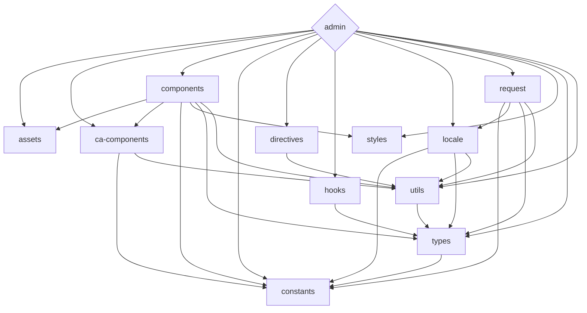

<div align='center'>
<h1>Celeris Web</h1>

</div>

<div align='center'>
<a href="README.md">English</a>| <b>简体中文</b>
</div>

## 简介

Celeris Web是一个免费开源的前端开发框架，采用最新的技术，包括Vue 3、Vite和TypeScript。其monorepo方法使得依赖管理和多个项目的协作变得轻松，为开发人员提供了构建现代Web应用程序的全面解决方案。

Celeris Web的一个特色是它与OpenAI的ChatGPT API集成，提供了强大的自然语言处理功能。此集成使得开发人员可以轻松地将自然语言处理集成到其应用程序中，是需要此功能的项目的理想选择。

无论您是经验丰富的开发人员还是刚刚入门，Celeris Web都提供了一个简化的前端开发流程，利用最新的工具和技术。

立即开始使用Celeris Web，并体验高度简化的前端开发流程，利用最新技术，包括尖端自然语言处理功能。

## 特点

- ⚡ [闪电般快速](https://github.com/kirklin/celeris-web#readme)：使用Vue 3，Vite和pnpm构建 🔥
- 💪 [强类型](https://www.typescriptlang.org/)：使用TypeScript 💻
- 📂 [单库存储](https://en.wikipedia.org/wiki/Monorepo)：易于管理依赖项和协作多个项目 🤝
- 🔥 [最新语法](https://github.com/vuejs/rfcs/pull/227)：使用新的< script setup >语法 🆕
- 📦 [自动导入组件](https://github.com/kirklin/celeris-web/blob/master/packages/node/vite/src/plugins/unpluginVueComponets.ts)：自动导入组件 🚚
- 📥 [自动导入API](https://github.com/kirklin/celeris-web/blob/master/packages/node/vite/src/plugins/unpluginAutoImport.ts)：使用unplugin-auto-import直接导入Composition API和其他API 📨
- 💡 [官方路由器](https://router.vuejs.org/)：使用Vue Router v4 🛣️
- 🎉 [加载反馈](https://github.com/rstacruz/nprogress)：使用NProgress提供页面加载进度反馈 🔄
- 🍍 [状态管理](https://pinia.esm.dev/)：使用Pinia进行状态管理 🗃️
- 📜 [中文字体预设](https://github.com/kirklin/unocss-preset-chinese)：包含中文字体预设 🇨🇳
- 🌍 [国际化就绪](https://github.com/kirklin/celeris-web/tree/master/packages/web/locale)：具备使用本地化的国际化功能 🌎
- ☁️ [Netlify准备就绪](https://www.netlify.com/)：在Netlify上零配置部署 ☁️
- 🤖 集成[OpenAI的ChatGPT API](https://openai.com/)：用于自然语言处理 🤖

### 编码风格

- [@kirklin/eslint-config](https://github.com/kirklin/eslint-config)

### 推荐的 IDE 设置

- 🌪️ [WebStorm](https://www.jetbrains.com/webstorm/)
- 💻 [VSCode](https://code.visualstudio.com/)
- 💡 [Volar](https://marketplace.visualstudio.com/items?itemName=johnsoncodehk.volar)

### [packages](packages)的依赖关系



要更新上面的图表，请编辑README文件，并在修改后打开一个新的PR。

## 中英文双语注释

在Celeris Web的设计中，我们注重代码的可读性和学习性，为此，我们为每个函数都配备了中英文双语注释，以确保无论您的母语是中文还是英文，都能轻松理解和学习代码。

**为什么选择中英文双语注释？**

1. **全球协作：** 在多语言团队中，中英文双语注释能够促进更好的沟通和协作，确保团队成员都能准确理解代码的功能和实现。

2. **学习便捷：** 对于新手来说，中英文双语注释提供了更友好的学习环境，帮助他们更快速地掌握代码的逻辑和结构。

3. **开发者友好：** 我们致力于构建一个开发者友好的开发环境，中英文双语注释是我们为实现这一目标而采取的一项关键措施。

4. **示例：**

```typescript
   /**
    * 打开一个新的浏览器窗口
    * Open a new browser window
    *
    * @param {string} url - 要在新窗口中打开的 URL
    * The URL to open in the new window
    *
    * @param {object} options - 打开窗口的选项
    * Options for opening the window
    * @param {string} options.target - 新窗口的名称或特殊选项，默认为 "_blank"
    * @param {string} options.features - 新窗口的特性（大小，位置等），默认为 "noopener=yes,noreferrer=yes"
    */
   export function openWindow(url: string, { target = "_blank", features = "noopener=yes,noreferrer=yes" }: {
     target?: "_blank" | "_self" | "_parent" | "_top"; // 新窗口的名称或特殊选项，默认为 "_blank"
     features?: string; // 新窗口的特性（大小，位置等），默认为 "noopener=yes,noreferrer=yes"
   } = {}) {
     window.open(url, target, features);
   }
```

通过这样的中英文双语注释，我们希望为开发者提供更愉悦、更高效的编码体验，让Celeris Web成为一个真正容易上手和深入学习的前端模板。

## Monorepo 设计的好处

**1. 依赖管理更轻松：** Monorepo 将所有项目的依赖项集中管理，避免了不同项目之间版本冲突的问题，使得整体的依赖管理更加清晰和简便。

**2. 代码共享与重用：** 不同项目之间可以方便地共享和重用代码，减少重复开发的工作量。这对于保持代码一致性和提高开发效率非常有利。

**3. 统一的构建和部署：** Monorepo 可以通过统一的构建和部署流程，简化整个开发过程，减少了配置和管理的复杂性，提高了开发团队的协作效率。

**4. 统一的版本控制：** 所有项目都在同一个版本控制仓库中，使得版本管理更加一致和可控。这有助于团队协同开发时更好地追踪和处理版本问题。 Monorepo设计让Celeris Web不仅是一款后台管理系统模板，同时也是一个快速开发C端产品的前端Web模板。有了Celeris Web，前端开发之路将更加轻松愉快！🚀

## 设计理念：突破Admin管理的局限性，关注C端用户体验

在市面上，大多数前端模板都着眼于满足B端用户的需求，为企业管理系统（Admin）提供了强大的功能和灵活的界面。然而，很少有模板将C端产品的特点纳入设计考虑，这正是我们Celeris Web的创新之处。

**突破Admin管理的局限性：**

传统的Admin管理系统更注重数据展示和业务管理，但C端产品更加侧重用户体验和视觉吸引力。我们深知C端用户对于界面美观、交互流畅的要求，因此Celeris Web不仅提供了强大的后台管理功能，更注重让前端界面在用户层面上达到更高水平。

**关注C端用户体验：**

Celeris Web不仅仅是一个后台管理系统的模板，更是一个注重C端用户体验的前端Web模板。我们致力于打破传统Admin系统的束缚，通过引入崭新的设计理念，使得C端产品在前端呈现上具备更为出色的用户体验。

**特色亮点：**

- **时尚美观的UI设计：** 我们注重界面的美感，采用现代化设计语言，使得Celeris Web的UI不仅仅是功能的堆砌，更是一种视觉盛宴，让C端用户爱不释手。

- **用户友好的交互体验：** 考虑到C端用户的习惯和需求，Celeris Web注重交互体验的设计，通过流畅的动画效果和直观的操作，使用户感受到前所未有的愉悦和便捷。

- **个性化定制的主题支持：** 我们理解C端产品的多样性，因此提供了丰富的主题定制选项，让每个C端项目都能拥有独一无二的外观，更好地满足产品个性化的需求。

通过这一独特的设计理念，Celeris Web致力于在前端开发领域探索全新的可能性，为C端产品注入更多活力和创意。我们相信，这样的创新将带来更广泛的用户认可和更高的产品价值。在Celeris Web的世界里，前端不再局限于Admin系统，而是融入了更多关于用户体验的精彩元素。

## 后期发展路线：瞄准AIGC，引领互联网产品变革

随着人工智能与图形计算（AIGC）技术的崛起，我们决定将Celeris Web的发展方向更加专注于推动AIGC相关产品的研发和落地。这一战略决策旨在顺应互联网产品的变革浪潮，为未来的科技创新开辟全新的可能性。

**AIGC技术引领变革：**

AIGC的兴起标志着互联网产业迎来了一场技术变革，为产品带来更加智能、交互性更强的体验。Celeris Web将积极响应这一变革，致力于为开发者提供更优秀的工具，助力他们在AIGC领域创造更具前瞻性的产品。

**模板的研发重心：**

在后期的发展中，Celeris Web将更加重视AIGC相关产品的研发需求。我们将推出更多针对人工智能的功能模块，使开发者能够更便捷、高效地构建出色的AIGC应用。

**专注产品落地：**

除了技术研发，我们将加强对AIGC产品落地的支持。通过提供详实的文档、示例和定制化服务，Celeris Web旨在帮助开发者更好地将AIGC技术融入他们的实际项目中，实现技术创新与商业应用的有机结合。

**开放合作生态：**

为了推动AIGC技术的更广泛应用，Celeris Web将积极构建开放合作生态。与行业内优秀的AIGC技术提供商、开发者社区保持密切合作，共同推动AIGC技术的发展，携手打造更加繁荣的互联网产品生态圈。

Celeris Web未来的发展将以AIGC为核心，我们期待在这个快速发展的技术领域中，与开发者们一同探索、创新，共同引领互联网产品的未来。通过持续的努力和创新，Celeris Web将成为AIGC领域的引领者，助力开发者创造更加智能、引人入胜的互联网产品。

## 快来试试吧！！

### GitHub 模板

[使用这个模板创建仓库](https://github.com/kirklin/celeris-web/generate).

### 克隆到本地

```bash
npx degit kirklin/celeris-web my-vite-app
cd my-vite-app
pnpm i
```

## 使用

### 开发

只需要执行以下命令就可以在 http://localhost:8888 中看到

```bash
pnpm run dev
```

### 构建

构建该应用只需要执行以下命令

```bash
pnpm run build
```

然后你会看到用于发布的 `dist` 文件夹被生成。

### 部署到 Netlify

前往 [Netlify](https://app.netlify.com/start) 并选择你的仓库, 一路 `OK` 下去，稍等一下后，你的应用将被创建.

### Docker Production Build

首先，在项目的根目录下打开终端，构建celeris-web镜像。

```bash
docker buildx build . -t celeris-web:latest
```

运行镜像，用 "-p" 指定端口映射。

```bash
docker run --rm -it -p 8080:80 celeris-web:latest
```
