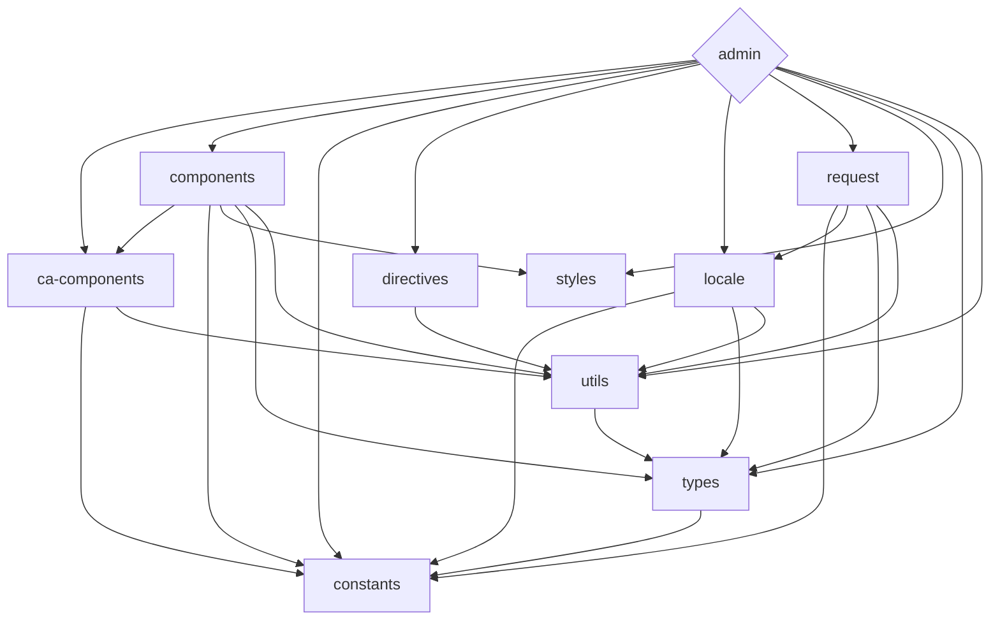

<div align='center'>
<h1>celeris-admin </h1>

</div>

<div align='center'>
<a href="README.md">English</a>| <b>简体中文</b>
</div>

## 简介
Celeris-admin是一个免费的开源中后台模板，使用了最新的技术。它使用Vue3、Vite、TypeScript等尖端工具，为前端开发提供了全面的解决方案。此外，其monorepo方法可以轻松管理依赖关系和协作多个项目。

这个模板不仅适用于生产使用，还可以作为开发人员熟悉最新技术栈的有价值学习资源。

开始使用Celeris-admin，简化您的前端开发流程。


## 特性

- ⚡  [Vue 3](https://github.com/vuejs/vue-next), [Vite](https://github.com/vitejs/vite), [pnpm](https://pnpm.js.org/) - 为速度而生
- 💪 [Typescript](https://www.typescriptlang.org/) - 强大的类型检查
- 📂 使用了 [monorepo](https://en.wikipedia.org/wiki/Monorepo) 方案
- 🔥 使用 [新的 `<script setup>` 语法](https://github.com/vuejs/rfcs/pull/227)
- 🤙🏻 默认开启 [响应性语法糖](https://vuejs.org/guide/extras/reactivity-transform.html)
- 📦 [组件自动化加载](./src/components)
- 📥 [API 自动加载](https://github.com/antfu/unplugin-auto-import) - 直接使用 Composition API 无需引入
- 💡 [Vue Router v4](https://router.vuejs.org/zh/) - Vue 路由系统
- 🎉 [NProgress](https://github.com/rstacruz/nprogress) - 页面加载进度反馈
- 🍍 [使用 Pinia 的状态管理](https://pinia.esm.dev/)
- 📜 [中文字体font-family常用预设]() 
- 🌍 [I18n 国际化开箱即用](./src/locales)
- ☁️ 零配置部署 Netlify


### 编码风格

- [@kirklin/eslint-config](https://github.com/kirklin/eslint-config)

### 推荐的 IDE 设置

- [VSCode](https://code.visualstudio.com/)
- [Volar](https://marketplace.visualstudio.com/items?itemName=johnsoncodehk.volar)


### [packages](packages)的依赖关系



要更新上面的图表，请编辑README文件，并在修改后打开一个新的PR。

## 快来试试吧！！

### GitHub 模板

[使用这个模板创建仓库](https://github.com/kirklin/celeris-admin/generate).

### 克隆到本地

```bash
npx degit kirklin/celeris-admin my-vite-app
cd my-vite-app
pnpm i
```

## 使用

### 开发

只需要执行以下命令就可以在 http://localhost:8888 中看到

```bash
pnpm run dev
```

### 构建

构建该应用只需要执行以下命令

```bash
pnpm run build
```

然后你会看到用于发布的 `dist` 文件夹被生成。


### 部署到 Netlify

前往 [Netlify](https://app.netlify.com/start) 并选择你的仓库, 一路 `OK` 下去，稍等一下后，你的应用将被创建.

### Docker Production Build

首先，在项目的根目录下打开终端，构建celeris-admin镜像。

```bash
docker buildx build . -t CelerisAdmin:latest
```

运行镜像，用 "-p" 指定端口映射。

```bash
docker run --rm -it -p 8080:80 CelerisAdmin:latest
```

