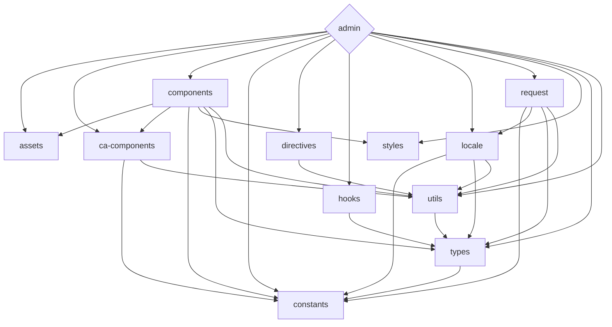

<div align='center'>
<h1>Celeris Web</h1>

</div>

<div align='center'>
<a href="README.md">English</a>| <b>简体中文</b>
</div>

## 简介
Celeris Admin是一个免费开源的前端开发框架，采用最新的技术，包括Vue 3、Vite和TypeScript。其monorepo方法使得依赖管理和多个项目的协作变得轻松，为开发人员提供了构建现代Web应用程序的全面解决方案。

Celeris Admin的一个特色是它与OpenAI的ChatGPT API集成，提供了强大的自然语言处理功能。此集成使得开发人员可以轻松地将自然语言处理集成到其应用程序中，是需要此功能的项目的理想选择。

无论您是经验丰富的开发人员还是刚刚入门，Celeris Admin都提供了一个简化的前端开发流程，利用最新的工具和技术。

立即开始使用Celeris Admin，并体验高度简化的前端开发流程，利用最新技术，包括尖端自然语言处理功能。


## 特点

- ⚡  [闪电般快速](https://github.com/kirklin/celeris-web#readme)：使用Vue 3，Vite和pnpm构建 🔥
- 💪 [强类型](https://www.typescriptlang.org/)：使用TypeScript 💻
- 📂 [单库存储](https://en.wikipedia.org/wiki/Monorepo)：易于管理依赖项和协作多个项目 🤝
- 🔥 [最新语法](https://github.com/vuejs/rfcs/pull/227)：使用新的< script setup >语法 🆕
- 📦 [自动导入组件](https://github.com/kirklin/celeris-web/blob/master/packages/node/vite/src/plugins/unpluginVueComponets.ts)：自动导入组件 🚚
- 📥 [自动导入API](https://github.com/kirklin/celeris-web/blob/master/packages/node/vite/src/plugins/unpluginAutoImport.ts)：使用unplugin-auto-import直接导入Composition API和其他API 📨
- 💡 [官方路由器](https://router.vuejs.org/)：使用Vue Router v4 🛣️
- 🎉 [加载反馈](https://github.com/rstacruz/nprogress)：使用NProgress提供页面加载进度反馈 🔄
- 🍍 [状态管理](https://pinia.esm.dev/)：使用Pinia进行状态管理 🗃️
- 📜 [中文字体预设](https://github.com/kirklin/unocss-preset-chinese)：包含中文字体预设 🇨🇳
- 🌍 [国际化就绪](https://github.com/kirklin/celeris-web/tree/master/packages/web/locale)：具备使用本地化的国际化功能 🌎
- ☁️ [Netlify准备就绪](https://www.netlify.com/)：在Netlify上零配置部署 ☁️
- 🤖 集成[OpenAI的ChatGPT API](https://openai.com/)：用于自然语言处理 🤖


### 编码风格

- [@kirklin/eslint-config](https://github.com/kirklin/eslint-config)

### 推荐的 IDE 设置

- 🌪️ [WebStorm](https://www.jetbrains.com/webstorm/)
- 💻 [VSCode](https://code.visualstudio.com/)
- 💡 [Volar](https://marketplace.visualstudio.com/items?itemName=johnsoncodehk.volar)

### [packages](packages)的依赖关系



要更新上面的图表，请编辑README文件，并在修改后打开一个新的PR。

## 快来试试吧！！

### GitHub 模板

[使用这个模板创建仓库](https://github.com/kirklin/celeris-web/generate).

### 克隆到本地

```bash
npx degit kirklin/celeris-web my-vite-app
cd my-vite-app
pnpm i
```

## 使用

### 开发

只需要执行以下命令就可以在 http://localhost:8888 中看到

```bash
pnpm run dev
```

### 构建

构建该应用只需要执行以下命令

```bash
pnpm run build
```

然后你会看到用于发布的 `dist` 文件夹被生成。


### 部署到 Netlify

前往 [Netlify](https://app.netlify.com/start) 并选择你的仓库, 一路 `OK` 下去，稍等一下后，你的应用将被创建.

### Docker Production Build

首先，在项目的根目录下打开终端，构建celeris-web镜像。

```bash
docker buildx build . -t celeris-web:latest
```

运行镜像，用 "-p" 指定端口映射。

```bash
docker run --rm -it -p 8080:80 celeris-web:latest
```

